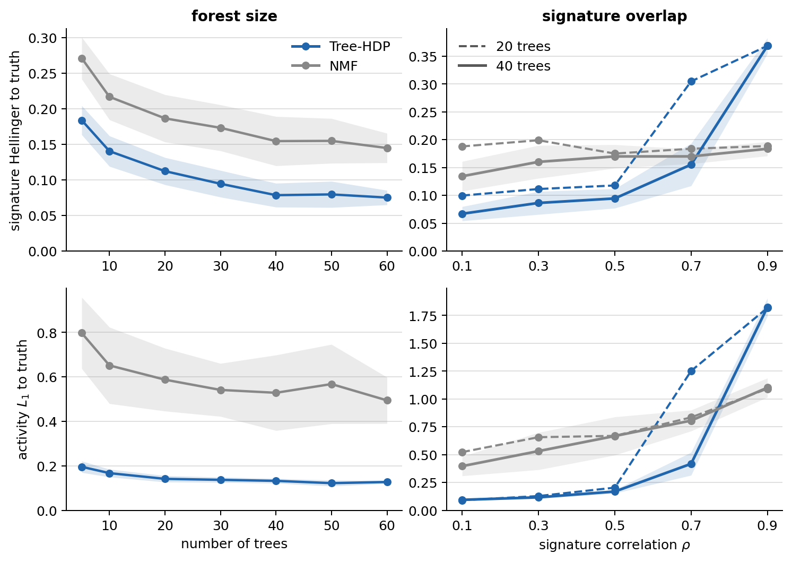

# Tree-HDP: mutational signature activities on tumour phylogenies

A Bayesian model that infers mutational-signature activities across the subclones
of a tumour **using the phylogenetic tree that relates them**, the structure the
standard NMF decomposition throws away. This repository holds the model, the
simulation and inference pipeline, and everything needed to reproduce the figures
and the table in the accompanying [lab-rotation report](report/final_report.pdf),
*Mutational Signature Activities on Tumour Phylogenies* (Radoslav Jochman,
supervised by Dr. Jack Kuipers and Prof. Dr. Niko Beerenwinkel).

---

## Overview

A cancer genome accumulates mutations from several processes, each leaving a
characteristic 96-channel signature. Recovering which processes were active, and
how strongly, in each subclone of a tumour is a central task in cancer genomics.
The standard tool, non-negative matrix factorisation (NMF), treats subclones as
exchangeable and ignores that some are more closely related than others. But
single-cell sequencing resolves a tumour into subclones and reconstructs the
phylogeny relating them, and subclones sharing recent ancestry should have similar
activity. Tree-HDP places the activities on that tree, so the model shares
statistical strength between related subclones and recovers them more reliably
where the signatures are distinguishable.

The project has two tracks: a **fixed-signature** model that infers only the
per-node activities from a known signature set, and a **de novo** model that infers
the signatures jointly with the activities. Both are evaluated on simulated cohorts
against NMF.

---

## The model

**Generative process** (`src/models/hdp_simulator.py`, `TreeSwitchDriftGenerator`).
A switch-plus-drift forward simulator (see `simulator_spec.md`), independent of
the inference model below. Signatures are loaded from a named catalogue, never
synthesised. On each tree, a binary active set per signature evolves down the
branches as a two-state gain/loss process (flip probability rising with branch
length), and among the active signatures the activity vector drifts by a
mean-preserving Dirichlet step whose concentration scales with branch length:

```
a_j ~ gain/loss process along the tree          # active set, binary per signature
e_j ~ Dir(conc * base(e_parent, a_j))           # mean-preserving drift, a_j's support only
M_j ~ NegBin(mean, r)                           # per-node mutation burden
x_j ~ DirMultinomial(M_j, kappa * e_j S)        # observed 96-channel counts
```

with `S` the `K x 96` signature matrix. Off signatures are exact zeros, so on/off
recovery is a real question rather than an artefact of a compositional floor.

**Inference** (`src/models/hdp_inference.py`, `TreeHDP`). One model for both
tracks, under a shared **ILR (sum-zero) activity walk** in unconstrained
log-ratio space, written non-centred so NUTS samples it cleanly:

```
eta_j = eta_parent(j) + sigma * z_j,   z_j ~ ZeroSumNormal(1),   e_j = softmax(eta_j)
```

`S` is either fixed (known signatures; component k already is true signature k,
so there is no label switching) or latent (`S_k ~ Dir(beta * 1_96)`, inferred
jointly with the activities, the de novo track) -- the fixed case is the same
model with `S` clamped to a constant instead of drawn. The latent case introduces
a label-switching symmetry (handled by aligning every posterior draw to a
reference labelling) and a shape/activity trade-off that, without help, makes the
chains settle into several clusters; a forest-pooled per-signature usage level
`mu_level` keeps them from splitting on the harder de novo problem.

**NMF baseline** (`scripts/nmf_baseline.py`). scikit-learn NMF on the flattened
observed-node counts (it ignores the tree), generalised Kullback-Leibler loss,
best of ten restarts, aligned to the truth by Hungarian matching on cosine. This
is the comparison in Figure 7.

---

## Installation

Python 3.10 or newer.

```bash
python -m venv .venv
source .venv/bin/activate
pip install -r requirements.txt
```

Sampling uses PyMC and ArviZ; the figures use matplotlib and pandas only. **All
commands below are run from the `scripts/` directory**, because the config files
reference `../data`, `../results` and `../COSMIC_sig` relative to it. Every config
fixes `simulation.seed`, so data generation and sampling are deterministic.

---

## Repository layout

```
src/
  models/      hdp_simulator.py (generator), hdp_inference.py (TreeHDP)
  analysis/    analysis.py (align, forest, distances), evaluation.py
  plotting/    figure_style.py (shared palette), plots.py
  config.py    YAML config loader

scripts/       run from here
  generate_data.py            config -> ../data/<name>/  (counts, tree, truth)
  run_inference.py            fixed (-> trace.nc) or de novo (-> trace_raw.nc, trace_aligned.nc),
                               picked by inference.model in the config
  recovery_vs_truth.py        score a trace against the truth
  nmf_baseline.py             NMF comparison on the same counts
  scaling_metrics.py          one convergence+accuracy row per fixed-sig run (Table 1)
  diagnose_modes.py / plot_mode_analysis.py     de novo clusters (Figures 2-5)
  diagnose_camp_path.py / plot_camp_path.py     mixing geometry (Figure 6)
  make_replicate_configs.py   expand a base config into 15 replicate configs
  run_replicates.sbatch       SLURM array: generate -> infer -> score, per replicate
  aggregate_replicates.py     replicates -> mean/std -> aggregated_summary.csv
  plot_sweep_comparison.py    recovery vs NMF, both sweeps (Figure 7)
  plot_data_scaling_figure.py

configs/       bases_*/ (one base per setting), corr_sweep/ corr_sweep_40/ size_sweep/
               (replicate configs + manifests), config_fixed_realistic_data_sweep_*.yaml
COSMIC_sig/    cosmic_signatures.csv  (10 real COSMIC SBS profiles)
results/agg/, results/agg40/, results/scaling_results.csv   committed metrics (fast path)
plots/         the report figures
report/        the lab-rotation report (Final_Report.pdf, and .tex / refs.bib source)
```

---

## Reproducing the report

The report's runs are pinned to git tags (`fixed-sig-v2` for the fixed-signature
track, `denovo-v1-ilr` for de novo; see `CLAUDE.md`). Both the inference model
(now unified into `TreeHDP`) and the data generator (rewritten to the
switch-plus-drift design, `simulator_spec.md`) have since changed, so the data
generation commands below only reproduce the report's numbers when run against
the tagged commit, not the current checkout -- `git checkout <tag>` first.

There are two ways in. **Option A** rebuilds the figures from the aggregated CSVs
committed to the repository, in seconds, with no cluster, and works from the
current checkout since it only reads those committed CSVs. **Option B**
regenerates those CSVs from scratch and needs both the cluster (many chains,
many hours) and the appropriate tag checked out.

### Option A — fast path (from the committed CSVs)

```bash
cd scripts

# Figure 7: Tree-HDP vs NMF, both sweeps, from ../tables/agg and ../tables/agg40
python plot_sweep_comparison.py --agg ../tables/agg --agg40 ../tables/agg40 --outdir ../report/figures

# Scaling figure + Table 1 numbers, from ../tables/scaling_results.csv
python plot_data_scaling_figure.py --scaling-csv ../tables/scaling_results.csv --outdir ../report/figures
```

Table 1 is read directly from the committed `scaling_results.csv`. Figures 2 to 6
characterise a single de novo run and need that run's trace, which is too large to
commit, so they are part of Option B. Figure 1 (the activity-walk schematic)
predates the simulator rewrite and can no longer be regenerated; see the
figure-to-command map below.

### Option B — full pipeline

**Table 1 and the scaling figure — fixed-signature runs over forest size.**
Each run generates its data, fits the fixed-signature model, and appends one row
(convergence and accuracy) to the shared table.

```bash
cd scripts
for N in 05 10 15 20 25 30 35 40; do
  CFG=../configs/config_fixed_realistic_data_sweep_$N.yaml
  NAME=$(python -c "import yaml; print(yaml.safe_load(open('$CFG'))['experiment_name'])")
  python generate_data.py --config $CFG
  python run_inference.py  --config $CFG
  python scaling_metrics.py \
      --trace ../results/$NAME/trace.nc \
      --true-activities ../data/$NAME/true_activities.csv \
      --newick ../data/$NAME/newick_string.nwk \
      --n-trees $((10#$N)) --out ../results/scaling_results.csv
done
python plot_data_scaling_figure.py --scaling-csv ../results/scaling_results.csv --outdir ../plots
```

**Figures 2 to 6 — de novo clusters and mixing geometry.**
One de novo run, twenty trees at overlap rho = 0.3, is the worked example.

```bash
cd scripts
CFG=../configs/bases_corr_sweep/config_denovo_corr_0.3_20_trees_synth_ilr.yaml
D=../data/config_denovo_corr_03_20_trees_synth_ilr
R=../results/config_denovo_corr_03_20_trees_synth_ilr

python generate_data.py         --config $CFG
python run_inference.py         --config $CFG      # inference.model: denovo -> $R/trace_raw.nc

# Figures 2-5: the clusters
python diagnose_modes.py \
    --trace $R/trace_raw.nc \
    --true-signatures $D/fixed_signatures.csv \
    --true-activities $D/true_activities.csv \
    --outdir $R/modes
python plot_mode_analysis.py --indir $R/modes --outdir ../plots

# Figure 6: the mixing geometry
python diagnose_camp_path.py \
    --trace $R/trace_raw.nc \
    --counts $D/mutation_count_matrix.csv \
    --newick $D/newick_string.nwk \
    --num-signatures 10 --outdir $R/camp_path
python plot_camp_path.py --indir $R/camp_path --outdir ../plots
```

**Figure 7 — recovery vs NMF over both sweeps.**
Each setting is 15 independent replicates. Build the replicate configs from the
committed bases, run them on the cluster, then aggregate. The example below is the
overlap sweep at 20 trees; repeat with `bases_corr_sweep_40` into `corr_sweep_40`
(aggregating to `results/agg40/corr_*`) and with `bases_size_sweep` into
`size_sweep` (aggregating to `results/agg/size_*`).

```bash
cd scripts

# 1. expand each base into 15 replicate configs + manifests (one manifest per sweep)
for RHO in 0.1 0.3 0.5 0.7 0.9; do
  python make_replicate_configs.py \
      --base ../configs/bases_corr_sweep/config_denovo_corr_${RHO}_20_trees_synth_ilr.yaml \
      --n-reps 15 --setting-value $RHO --outdir ../configs/corr_sweep --append
done

# 2. run on the cluster: one array task per manifest line (generate -> infer -> score -> NMF).
#    Set --array to 0..(N-1) where N is the number of manifest lines (5 settings x 15 = 75).
sbatch --array=0-74%8 run_replicates.sbatch configs/corr_sweep/manifest_configs.txt denovo

# 3. collapse replicates into the mean/std tables the figure reads
python aggregate_replicates.py --manifest ../configs/corr_sweep/manifest_agg.csv \
    --kind summary --outdir ../results/agg/corr_treehdp
python aggregate_replicates.py --manifest ../configs/corr_sweep/manifest_agg_nmf.csv \
    --kind summary --outdir ../results/agg/corr_nmf

# 4. draw the figure
python plot_sweep_comparison.py --agg ../results/agg --agg40 ../results/agg40 --outdir ../plots
```

### Figure-to-command map

| Report artefact | Produced by |
|---|---|
| Figure 1 (activity walk) | retired -- generated by the pre-rewrite simulator (`generate_walk_figure.py`, removed); see `simulator_spec.md` |
| Table 1 + scaling figure | fixed-sig runs + `scaling_metrics.py` -> `plot_data_scaling_figure.py` |
| Figures 2-5 (de novo clusters) | de novo run + `diagnose_modes.py` -> `plot_mode_analysis.py` |
| Figure 6 (mixing geometry) | de novo run + `diagnose_camp_path.py` -> `plot_camp_path.py` |
| Figure 7 (recovery vs NMF) | both sweeps + `aggregate_replicates.py` -> `plot_sweep_comparison.py` |

---

## Results



The figure compares Tree-HDP (blue) against the NMF baseline (grey) on signatures
(top, Hellinger to truth) and activities (bottom, L1 to truth); lower is better.

Across **forest size** (left), Tree-HDP recovers both signatures and activities
better than NMF at every size, and the activity gap is the wider one, because
sharing activity between related nodes is exactly what the tree prior adds and NMF
discards.

Across **signature overlap** (right, overlaid at 20 trees dashed and 40 trees
solid), the picture depends on how much data the forest carries. While the
signatures are distinguishable (rho <= 0.5) Tree-HDP is far ahead. As overlap
rises it degrades and crosses below NMF. Doubling the forest to 40 trees pushes
that crossover out, at rho = 0.7 the extra data takes Tree-HDP from behind NMF to
ahead of it, but at the strongest overlap (rho = 0.9) neither method moves: the
signatures are non-identifiable there and no amount of tree structure separates
them. In the fixed-signature setting (Table 1), activity recovery is accurate even
with few trees and convergence stays clean throughout.

---

## Report and citation

The full write-up, including the model derivation, the mixing-geometry analysis,
and the reparameterisation, is in [`report/final_report.pdf`](report/final_report.pdf).
If you use this code, please cite the report and this repository:
`https://github.com/RadoslavJochman/Mutational_signatures_HDP`.